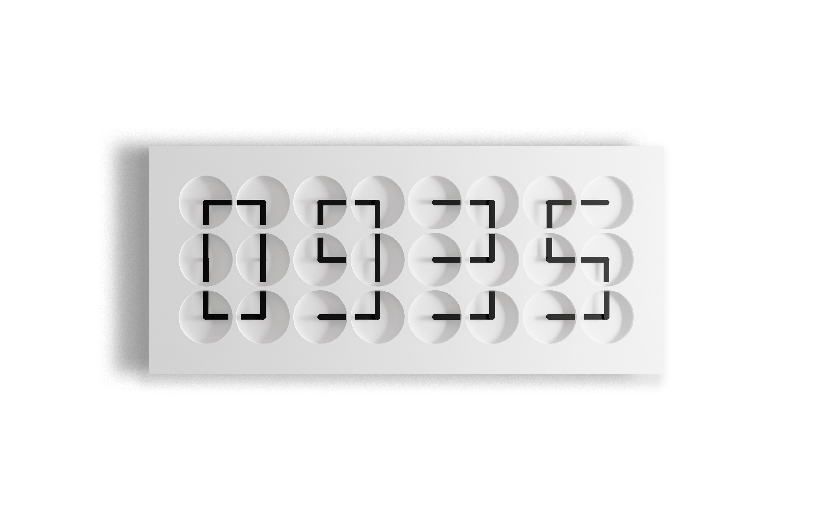

# Clock with islom uz radio





> Kit Kemp Design Studio and Humans since 1982 have collaborated to create a striking new ClockClock 24 edition. Both a kinetic sculpture and a functioning wall clock, embodying both analogue and digital elements the ClockClock 24 - Dada Blue is a mesmerising ode to the passing of time.

ClockClock 24 - Dada Blue consists of a handcrafted housing of mineral composite and electronic components. It is built on proprietary technology—in both software and hardware—which a team of in-house designers, engineers, and programmers has continuously developed since its inception. The objects are carefully hand-assembled at the studio in Stockholm.

The roots of this project reach back to 2008 when the first edition was launched as The Clock Clock, and later exhibited at the Saatchi Gallery in London in 2010. In 2016 it was reissued as ClockClock 24 in partnership with the MoMA store in New York. Today, artworks of this series are represented in the permanent collections of the Vitra Design Museum in Germany, the Musée International d'Horlogerie in Switzerland, and the Nationalmuseum in Sweden, among others.

## Setup
```bash

python main.py
```
# ICON download

https://icon-icons.com/icon/green-apple/75167
For MacOS icon file must be .ICNS
For Windows icon file must be .ICO

PACKAGING FOR MACOS:
https://www.pythonguis.com/tutorials/packaging-pyqt5-applications-pyinstaller-macos-dmg/

PACKAGING FOR WINDOWS:
https://www.pythonguis.com/tutorials/packaging-pyqt5-pyside2-applications-windows-pyinstaller/

# Common issues

1) Auto packaging for windows, macos, etc
2) Auto-test before packaging


# ACKNOWLEDGEMENT
https://www.humanssince1982.com/en-int

https://www.humanssince1982.com/en-int/products/cc24-dada-blue